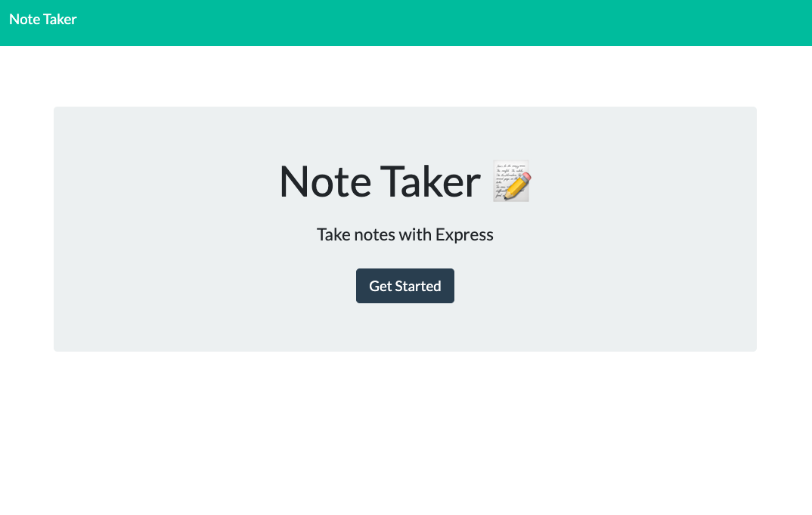
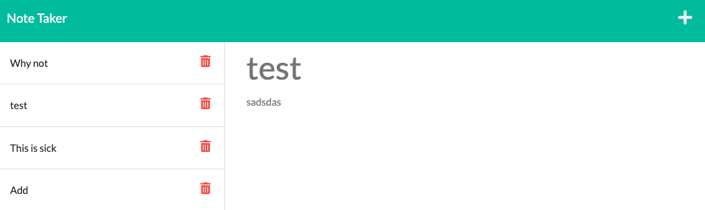

# noteTaker

## Description

Note taking app that can be used to write and save notes using Express.js and with a some note data to json file.

## Screenshots

Home Page

Notes Page

Adding a note

See old note, the last note is added to list

## Links

Live: https://sleepy-basin-87314.herokuapp.com/

Github: https://github.com/aaaziz2/noteTaker